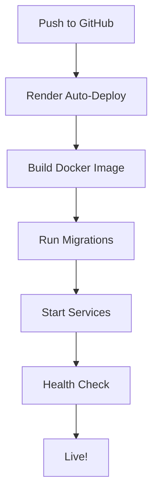

# 🌐 Render.com Deployment Guide

Complete guide for deploying AirBnB Backend to Render.com cloud platform.

## Quick Deployment

### Option 1: Automated Deployment (Recommended)

1. **Install Render CLI:**
   ```bash
   # macOS
   brew install render
   
   # Linux/WSL
   npm install -g @render/cli
   
   # Windows
   npm install -g @render/cli
   ```

2. **Run deployment script:**
   ```bash
   chmod +x deploy-render.sh
   ./deploy-render.sh
   ```

3. **Complete post-deployment setup** (see below)

### Option 2: Manual Dashboard Deployment

1. Sign up/Login to [Render.com](https://render.com)
2. Click "New" → "Blueprint"
3. Connect your GitHub repository: `Martin-Mawien/airbnb-backend`
4. Select `render.yaml`
5. Click "Apply"

---

## Post-Deployment Setup

### 1. Run Database Migrations

1. Go to Render Dashboard → `airbnb-backend-web` service
2. Click "Shell" tab
3. Run:
   ```bash
   python manage.py migrate
   python manage.py createsuperuser
   python manage.py collectstatic --noinput
   ```

### 2. Configure Environment Variables

Go to each service and verify/update environment variables:

**Critical Variables:**
- `SECRET_KEY`: Auto-generated (✓)
- `DEBUG`: Should be `0` (✓)
- `ALLOWED_HOSTS`: Add your custom domain if any
- `DATABASE_URL`: Auto-connected (✓)
- `REDIS_URL`: Auto-connected (✓)

### 3. Set Up Custom Domain (Optional)

1. Go to your web service settings
2. Click "Custom Domains"
3. Add your domain: `api.yourdomain.com`
4. Follow DNS configuration instructions

---

## Service Architecture

Your Render deployment includes:

### 1. **PostgreSQL Database** (`airbnb-postgres`)
- Plan: Starter
- Version: PostgreSQL 13
- Auto-backups included
- Internal connection only

### 2. **Redis Cache** (`airbnb-redis`)
- Plan: Starter
- Used for: Caching, Celery broker
- Auto-managed

### 3. **Web Service** (`airbnb-backend-web`)
- Docker-based deployment
- Gunicorn with 4 workers
- Auto-scaling ready
- Health checks enabled
- URL: `https://airbnb-backend-web.onrender.com`

### 4. **Celery Worker** (`airbnb-celery-worker`)
- Background task processing
- 2 concurrent workers
- Auto-restart on failure

### 5. **Celery Beat** (`airbnb-celery-beat`)
- Scheduled task scheduler
- Periodic tasks execution

---

## Deployment Workflow



---

## Environment Variables Reference

### Web Service

| Variable | Value | Description |
|----------|-------|-------------|
| `SECRET_KEY` | Auto-generated | Django secret key |
| `DEBUG` | `0` | Production mode |
| `ALLOWED_HOSTS` | `.onrender.com` | Allowed hostnames |
| `DB_NAME` | `airbnb_production` | Database name |
| `DB_USER` | `airbnb_user` | Database user |
| `DB_PASSWORD` | From database | Auto-connected |
| `DB_HOST` | From database | Auto-connected |
| `DB_PORT` | From database | Auto-connected |
| `REDIS_URL` | From Redis | Auto-connected |
| `WEB_CONCURRENCY` | `4` | Gunicorn workers |

---

## Monitoring & Logs

### View Logs
1. Go to Render Dashboard
2. Select your service
3. Click "Logs" tab
4. Filter by: Info, Warning, Error

### Metrics
- CPU Usage
- Memory Usage
- Request Rate
- Response Time

---

## Scaling

### Vertical Scaling (Upgrade Plan)
1. Go to service settings
2. Click "Change Plan"
3. Select higher tier (Standard, Pro)

### Horizontal Scaling (More Instances)
1. Edit `render.yaml`
2. Update `numInstances`:
   ```yaml
   numInstances: 2  # Run 2 instances
   ```
3. Push to GitHub

---

## Costs Estimate

### Free Tier
- Web Service: Free (with sleep)
- PostgreSQL: Free (expires after 90 days)
- Redis: Free (25MB)
- Workers: Free (with sleep)

### Starter Tier (~$28/month)
- Web Service: $7/month
- PostgreSQL: $7/month
- Redis: $7/month
- Celery Worker: $7/month
- Celery Beat: Free (shared with worker)

---

## Troubleshooting

### Deployment Fails
```bash
# Check build logs in Render Dashboard
# Common issues:
# 1. Missing environment variables
# 2. Database connection errors
# 3. Docker build failures
```

### Database Connection Issues
```bash
# Verify DATABASE_URL is set correctly
# Check database service is running
# Verify firewall rules allow internal connections
```

### Static Files Not Loading
```bash
# Run in Shell:
python manage.py collectstatic --noinput

# Or set DISABLE_COLLECTSTATIC=0 in env vars
```

---

## Backup & Restore

### Backup Database
```bash
# Via Render Dashboard:
# Database → Backups → Create Manual Backup

# Via CLI:
render backups create --database=airbnb-postgres
```

### Restore Database
```bash
# Via Dashboard: Select backup → Restore
# Via CLI: render backups restore <backup-id>
```

---

## Advanced Configuration

### Custom Build Commands
```yaml
# In render.yaml, add:
buildCommand: |
  pip install -r requirements.txt
  python manage.py collectstatic --noinput
```

### Pre-Deploy Commands
```yaml
# In render.yaml, add:
preDeployCommand: |
  python manage.py migrate --noinput
```

### Health Checks
```yaml
healthCheckPath: /api/health/
```

---

## Security Best Practices

1. **Never commit secrets to Git**
   - Use Render's environment variables
   - Use `generateValue: true` for sensitive data

2. **Enable HTTPS only**
   - Render provides free SSL certificates
   - Set `SECURE_SSL_REDIRECT=1`

3. **Configure CORS properly**
   - Update `ALLOWED_HOSTS` with your domains
   - Configure CORS headers

4. **Regular backups**
   - Enable automatic daily backups
   - Test restore procedures

---

## Continuous Deployment

### Auto-Deploy from GitHub

1. Go to service settings
2. Enable "Auto-Deploy"
3. Select branch (e.g., `main`)
4. Every push triggers deployment

### Deploy Hooks

Use deploy hooks for notifications:
```bash
# In render.yaml:
services:
  - type: web
    name: airbnb-backend-web
    buildFilter:
      paths:
        - airbnb/**
```

---

## Migration from Docker Compose

### Differences from Local Setup

| Feature | Local (Docker Compose) | Render |
|---------|----------------------|--------|
| Database | PostgreSQL in container | Managed PostgreSQL |
| Redis | Redis in container | Managed Redis |
| SSL | Manual (certbot) | Automatic |
| Scaling | Manual | Auto-scale |
| Backups | Manual | Automatic |

### Environment Variable Mapping

Update your code to use Render's environment variables:
- `DATABASE_URL` instead of separate `DB_*` variables
- `REDIS_URL` instead of `REDIS_HOST`

---

## Support & Resources

- [Render Documentation](https://render.com/docs)
- [Render Community Forum](https://community.render.com)
- [Django Deployment Guide](https://docs.djangoproject.com/en/stable/howto/deployment/)
- [Celery Documentation](https://docs.celeryproject.org/)

---

## Checklist

Before going live:

- [ ] Environment variables configured
- [ ] Database migrations run
- [ ] Static files collected
- [ ] Superuser created
- [ ] Health checks passing
- [ ] Custom domain configured (if needed)
- [ ] SSL certificate active
- [ ] Backups enabled
- [ ] Monitoring alerts configured
- [ ] Log retention policy set

---

## Quick Commands Reference

```bash
# Deploy to Render
./deploy-render.sh

# View logs
render logs <service-name>

# Open shell
render shell <service-name>

# Run migrations
render run python manage.py migrate

# Create superuser
render run python manage.py createsuperuser

# Restart service
render restart <service-name>

# Scale service
render scale <service-name> --instances=2
```

---

**Need Help?** Open an issue on GitHub or contact support@yourdomain.com
